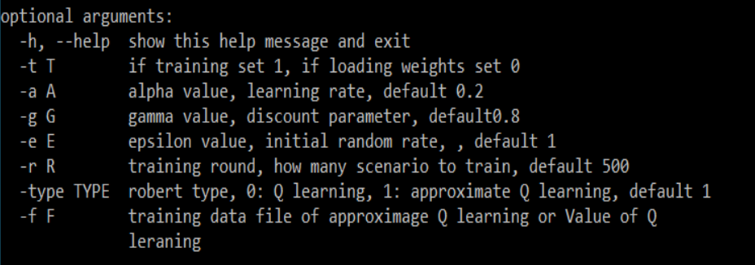
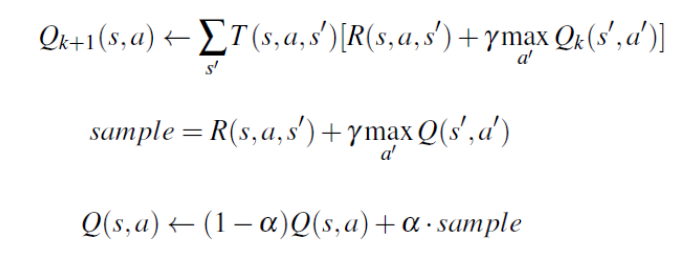
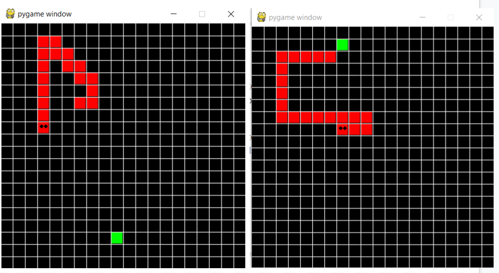

# Snake_QL_Approximate_QL
implement Snake agent with Q_learning and Approximate Q_learning

## Snake game
Download source codes of snake game coding with python. It is a simple game with less than 200 lines of codes
- link: https://github.com/techwithtim/Snake-Game
- replace the manual keyboard operation with the Q-learning agent and approximate Q-learning agent which can play the game automatically
## Command line
 

## Implement Q learning agent
### Initialize
  - alpha  0.2
  - gamma  0.8
  - epsilon    epsilon = 1 - (round * 1 / round)
  - loadData  load weights or values from csv file
  - saveData save weights or values to csv file
  - getQValue(self, state, action)
  - computeActionFromQValues(self, state)
  - getAction(self, state)  -> according to epsilon
    - random
    - optimal action
  - computeValueFromQValues(self, state)
  - update(self, oldState, action, reward, curState)
  
### State of snake agent
- part 1: action 
- part 2: positions, relative positions and some checking
  - x position of head equal 0 or 19?
  - y position of head equal 0 or 19?
  - relative x position of head to food?
  - relative y position of head to food?
  - If snake head surrounded by circle
  - y position of head equal y position of food?
  - x position of head >  x position of food?
  - y position of head > y  position of food?
  - get closer to food?
  - head crash body?
  - head crash wall?

### Reward
- +5  : eat food
- -10 : crash wall
- -7   : bite itself

### Update Q value
 
### Process of Training Q learning agent
There is balance of agent between crash the wall, bite itself and eat the food. By adjusting the parameters, the snake can improve its performance. On 20 X 20 board, highest score can reach 60.
- Change the values of rewards
- Add or remove some variables of state
- Train the snake agent
- Watch the train result
- Repeat above steps
 

## Implement Approximate Q learning agent
### Inherit from Q learning Agent. The highest score exceeds one hundred.
- getQValue: calculate Q Value  with weights instead of  Q-table
- update: update weights of features
- getFeatures: according to states produce related features

### Features of Approximate Q learning agent
- bias  1.0
- bite itself
- crash the wall
- eat the food
- distance to the food
- enter a danger circle
- body occupy whole row or column
- go to corner along wall

  
   

## Summary
- table of Q-value is huge, it produces huge amount of training data, while approximate Q- learning only stores several feature values
- Q learning is slow corresponding to its big Q-value table, while approximate Q- learning is very fast with better performance.
- Highest score. 
  - Q learning: approximate 60 
  - approximate Q learning: above 100
